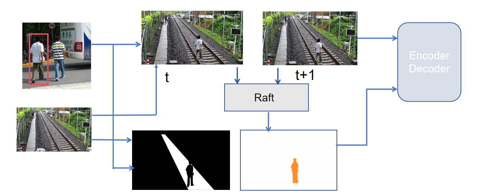

# Railway Intrusion Detection

## Introduction
In this repository, We introduce a segmentation based 
on synthetic images and optic flow. 

## Methods
Rather than detecting all kinds of potential intrusion
objects(which is impossible), we reformulate the task into
a binary-class segmentation task: railway or not. To fully
improve the generalization ability of our model,
We use Copy-Paste mechanism to generate abundant training data.
We leverage our previous CACP(context-aware copy-paste) pipeline.

